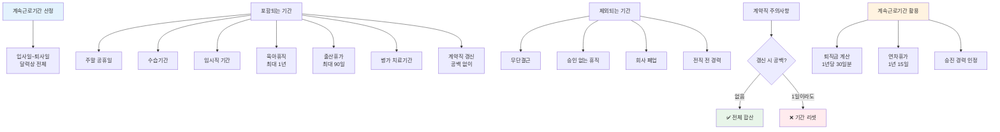

"회사에서 3년 일했는데 중간에 육아휴직 1년 했어요. 퇴직금 계산할 때 2년만 인정되나요?"

아니에요. 3년 전부 인정돼요. 계속근로기간은 입사일부터 퇴사일까지 전체 기간이고 휴직도 포함돼요. 정확한 계산법을 알려드릴게요.

## 계속근로기간 산정 방법은 뭔가요?

**입사일부터 퇴사일까지 달력상 전체 기간이에요.**

계속근로기간은 최초 근로계약을 시작한 날부터 끝난 날까지 모든 기간을 말해요. 실제로 일한 날만 세는 게 아니라 주말 공휴일 전부 포함이에요.

예를 들어 2023년 3월 1일 입사해서 2026년 2월 28일 퇴사하면 정확히 3년이에요. 이 기간에 주말 156일 공휴일 36일이 있어도 다 계속근로기간에 포함돼요. [근로기준법](https://www.law.go.kr/법령/근로기준법)에서 계속근로기간은 동일한 고용주와 계속해서 근로관계를 유지하는 기간으로 정하고 있어요.

수습기간도 포함돼요. 3개월 수습 후 정규직 전환됐어도 수습 첫날이 계속근로기간 시작일이에요. 임시직으로 입사해서 나중에 정규직 됐어도 마찬가지예요. 정규직 전환일이 아니라 최초 입사일부터 세요.

**포함되는 기간**
- 주말과 공휴일
- 수습기간
- 임시직 기간
- 계약직 갱신 기간
- 각종 법정 휴직

**제외되는 기간**
- 무단결근 기간
- 사업주 승인 없는 휴직
- 회사 폐업 기간
- 전직 전 경력

## 계속근로기간 기준 규정은 어떻게 되나요?

**휴직 기간도 전부 포함돼요.**

출산휴가 육아휴직 병가 다 포함이에요. 법으로 보장된 휴직은 근로관계가 끊어진 게 아니니까요. 회사 동의 받은 휴직도 마찬가지예요.

출산휴가는 최대 90일인데 이 기간도 계속근로기간이에요. 육아휴직은 최대 1년까지 가능하고 이것도 전부 포함이에요. [찾기쉬운 생활법령정보](https://easylaw.go.kr/CSP/CnpClsMain.laf?popMenu=ov&csmSeq=999&ccfNo=3&cciNo=1&cnpClsNo=2)에서 자세한 기준을 확인할 수 있어요.

업무상 재해로 치료받는 기간도 포함이에요. 회사 일하다 다쳐서 6개월 병원 다녀도 계속근로기간에서 빠지지 않아요. 노조 활동으로 휴직한 기간도 회사가 승인했으면 인정돼요.

반대로 무단결근은 안 돼요. 회사 허락 없이 1주일 결근했으면 그 1주일은 제외예요. 징계로 정직 먹었을 때도 논란이 있는데 대법원은 정직 기간도 포함한다고 봐요. 근로관계 자체는 유지되니까요.

## 계속근로기간 계산 방식은 어떻게 하나요?

**계약직은 갱신된 모든 기간을 합산해요.**

1년 계약직으로 입사해서 3번 갱신했다면 4년이에요. 계약 만료 후 바로 다시 계약했으면 중간에 끊어진 게 아니니까 전부 합산이에요.

예를 들어볼게요. 2023년 3월 1일부터 2024년 2월 29일까지 1년 계약했어요. 만료 당일 새 계약서 쓰고 2025년 2월 28일까지 1년 더 일했어요. 그럼 2023년 3월 1일부터 2025년 2월 28일까지 2년이 계속근로기간이에요.

중간에 하루라도 공백 있으면 끊겨요. 3월 1일 계약 끝나고 3월 3일 재계약하면 3월 2일 하루 때문에 계속근로기간이 리셋돼요. 새로 시작하는 거예요. 그래서 계약직은 만료일 당일이나 전날 꼭 갱신 계약서 써야 해요.

**계산 예시 1: 정규직**
- 입사: 2023년 3월 1일
- 육아휴직: 2024년 6월 1일~2025년 5월 31일 (1년)
- 퇴사: 2026년 2월 28일
- 계속근로기간: 3년 (육아휴직 포함)

**계산 예시 2: 계약직 갱신**
- 1차 계약: 2023년 3월 1일~2024년 2월 29일
- 2차 갱신: 2024년 3월 1일~2025년 2월 28일
- 계속근로기간: 1년 (하루 공백으로 리셋)

**계산 예시 3: 수습 후 정규직**
- 수습 시작: 2023년 3월 1일
- 정규직 전환: 2023년 6월 1일
- 퇴사: 2026년 2월 28일
- 계속근로기간: 3년 (수습 포함)

## 계속근로기간 관련 주의사항은 뭔가요?

**퇴직금 계산의 핵심이에요.**

퇴직금은 1년 이상 일해야 받아요. 364일 일하고 그만두면 한 푼도 못 받아요. 그래서 정확한 계속근로기간 계산이 중요해요.

퇴직금은 계속근로기간 1년당 30일분 평균임금이에요. 3년 일했으면 평균임금 90일분 받는 거예요. 월급 300만원이면 300만원 × 3개월 = 900만원 정도예요. 여기서 계속근로기간 계산 잘못하면 퇴직금이 달라져요.

실제 사례예요. A씨는 2020년 3월 입사해서 2024년 2월 퇴사했어요. 딱 4년인데 회사는 "중간에 육아휴직 1년 했으니까 3년치만 줄게"라고 했어요. 잘못됐어요. 육아휴직도 계속근로기간이니까 4년치 퇴직금 받아야 해요.

**확인해야 할 것**
- 최초 입사일 정확히 확인
- 계약서 갱신 날짜 체크
- 휴직 기간 회사 승인 여부
- 무단결근 날짜 파악

계약직은 더 조심해야 해요. 갱신할 때 하루라도 공백 생기면 계속근로기간이 끊겨요. 2년 일하고 공백 하루 있으면 퇴직금 못 받을 수도 있어요. 계약 만료 전에 미리 갱신 계약서 쓰거나 만료 당일 바로 써야 해요.

연차휴가도 계속근로기간으로 계산해요. 1년 일하면 15일 연차 생기고 3년 차부터 매년 1일씩 늘어나요. 계속근로기간 잘못 계산하면 연차도 못 받아요. [퇴직금 계산 방법](/w/퇴직금-계산)과 [평균임금 계산](/w/평균임금-계산)도 같이 확인하세요.

---

## 출처

- [근로기준법](https://www.law.go.kr/법령/근로기준법) - 법제처
- [찾기쉬운 생활법령정보](https://easylaw.go.kr/CSP/CnpClsMain.laf?popMenu=ov&csmSeq=999&ccfNo=3&cciNo=1&cnpClsNo=2) - 법제처

---

## 관련 문서

- [퇴직금 계산 방법](/w/퇴직금-계산)
- [평균임금 계산](/w/평균임금-계산)
- [연차휴가 일수](/w/연차휴가-일수)
