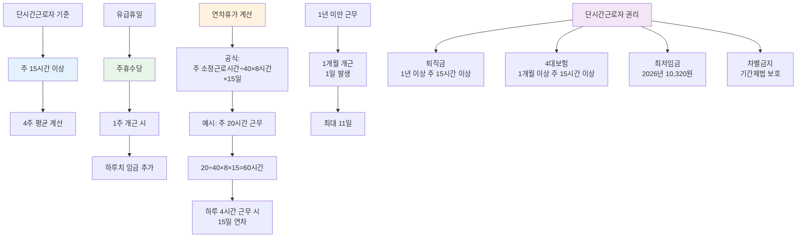

"아르바이트로 주 3일 일하는데 연차 같은 거 받을 수 있나요?"

주 15시간 이상 일하면 받을 수 있어요. 단시간근로자도 정규직처럼 유급휴일과 연차휴가 권리가 있어요. 어떻게 계산되는지 알려드릴게요.

## 단시간근로자 유급휴일은 어떻게 되나요?

주 15시간 이상 근무하면 주휴일을 유급으로 받아요. 이게 바로 주휴수당이에요.

주휴수당은 1주일 개근하면 하루치 임금을 추가로 받는 거예요. 예를 들어 시급 1만원에 주 3일(하루 6시간) 일하면, 일주일에 18시간 근무예요. 1주 개근하면 6시간치 주휴수당 6만원을 추가로 받아요. [근로기준법 제55조](https://www.law.go.kr/법령/근로기준법)에서 보장하는 권리예요.

주의할 점이 있어요. 1주일 중 하루라도 무단결근하면 그 주는 주휴수당이 안 나와요. 병가나 연차 사용은 괜찮지만, 사전 통보 없이 결근하면 주휴수당을 못 받아요. [주휴수당 계산법](/w/주휴수당-계산)에서 자세한 계산 방법을 확인하세요.

주 15시간 미만이면 어떻게 되냐고요? 주휴수당도 연차도 없어요. 이 기준이 중요해요. 고용주가 주휴수당 안 주려고 일부러 주 14시간만 일하게 하는 경우가 있는데, 실제로는 더 일했다면 증거 모아서 청구할 수 있어요.

## 단시간근로자 연차 계산은 어떻게 하나요?

시간 단위로 계산돼요. 정규직처럼 15일이 발생하지만, 실제 근무시간에 비례해서 시간으로 계산해요.

계산 공식이 있어요. (1주 소정근로시간 ÷ 40시간) × 8시간 × 15일이에요. 복잡해 보이지만 예를 들어 볼게요. 주 20시간 일하는 단시간근로자라면, (20 ÷ 40) × 8시간 × 15일 = 60시간이에요. 1년 근무하면 60시간의 연차를 받는 거예요.

하루 4시간씩 일한다면 60시간은 15일이에요. 하루 6시간씩 일한다면 10일이에요. 자신의 하루 근무시간으로 나누면 며칠인지 알 수 있어요. [고용노동부](https://www.moel.go.kr)에서 공식 계산기를 제공하니 확인해보세요.

1년 미만 근무자도 연차가 생겨요. 1개월 개근하면 1일의 연차가 발생해요. 최대 11일까지 생기고, 1년 채우면 15일로 새로 계산돼요. 이것도 시간으로 환산되니까, 주 20시간 근무자가 6개월 일했다면 (20 ÷ 40) × 8시간 × 6일 = 24시간의 연차예요.

## 단시간근로자 기준 규정은 뭔가요?

주 15시간 이상이 기준선이에요. 4주 평균으로 계산해요.

왜 4주 평균이냐면, 주마다 근무시간이 달라질 수 있거든요. 어떤 주는 12시간, 어떤 주는 18시간 이렇게 불규칙해도 4주 평균이 15시간 넘으면 권리를 받아요. 고용주가 "이번 주만 15시간 이하로 줄일게요"라고 해서 권리를 뺏을 수 없어요.

출근율도 중요해요. 1년 동안 80% 이상 출근해야 15일 연차가 발생해요. 80%가 뭐냐면, 1년 365일 중 약 292일 이상 출근한 거예요. 유급휴일이나 연차 사용은 출근으로 인정돼요. 무단결근이나 무급휴가만 출근율에서 빠져요.

사업장 규모는 상관없어요. 5인 이상 사업장이든 5인 미만이든, 단시간근로자 기준은 똑같아요. 근로기준법은 5인 이상 사업장에 적용되지만, 근로시간과 휴게시간, 주휴일은 5인 미만도 적용돼요. [근로기준법 제60조](https://www.law.go.kr/법령/근로기준법)에서 명시하고 있어요.

## 단시간근로자 관련 권리는 뭐가 더 있나요?

퇴직금, 4대보험, 최저임금 모두 적용돼요. 단시간이라고 차별 못 받아요.

퇴직금은 1년 이상 근무하고 주 15시간 이상이면 받아요. 주휴수당 포함해서 평균임금으로 계산해요. 4대보험은 1개월 이상 근무하고 주 15시간 이상이면 가입 대상이에요. 고용주가 "아르바이트라 4대보험 안 돼요"라고 하면 위법이에요.

최저임금도 똑같이 적용돼요. 2026년 최저시급은 1만 30원이에요. 단시간근로자라고 더 낮게 줄 수 없어요. 수습기간이라도 최저시급의 90%(9,027원) 이상은 받아야 해요. 3개월 넘으면 100% 받아야 하고요.

차별도 금지돼요. 동일한 일을 하는데 정규직보다 단시간근로자라는 이유만으로 임금을 적게 주거나 승진 기회를 안 주면 위법이에요. [기간제 및 단시간근로자 보호 등에 관한 법률](https://www.law.go.kr/법령/기간제및단시간근로자보호등에관한법률)에서 보호하고 있어요.

회사가 권리를 안 줄 때는 고용노동부에 진정할 수 있어요. 증거로 근로계약서, 급여명세서, 출퇴근 기록이 필요해요. 카톡이나 문자로 근무지시 받은 것도 증거가 돼요. [연차휴가 사용 방법](/w/연차휴가-사용)도 참고하세요.

---

## 출처

- [근로기준법 제60조](https://www.law.go.kr/법령/근로기준법) - 법제처
- [기간제 및 단시간근로자 보호 등에 관한 법률](https://www.law.go.kr/법령/기간제및단시간근로자보호등에관한법률) - 법제처
- [고용노동부](https://www.moel.go.kr) - 근로자 권리 안내

---

## 관련 문서

- [주휴수당 계산법](/w/주휴수당-계산)
- [연차휴가 사용 방법](/w/연차휴가-사용)
- [단시간근로자 권리](/w/단시간근로자-권리)
- [퇴직금 계산](/w/퇴직금-계산)
