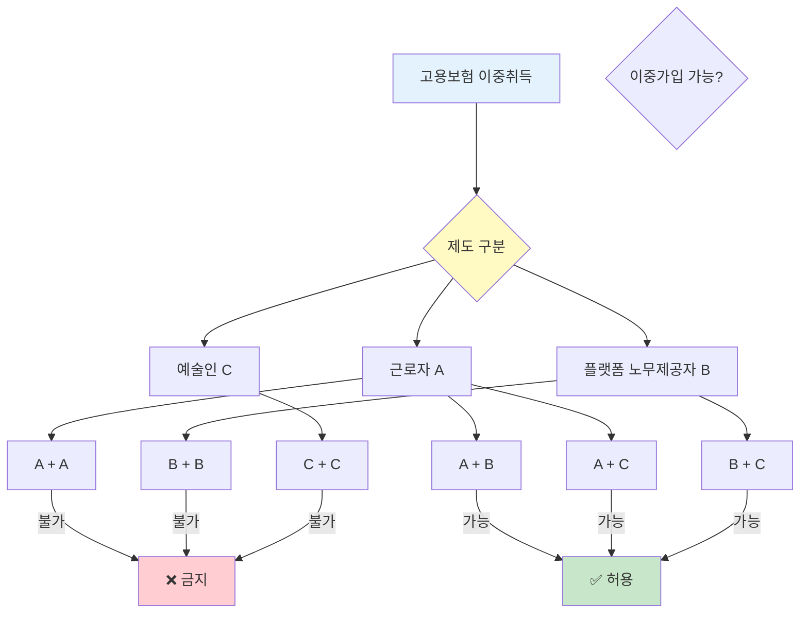

"직장 다니면서 퇴근 후 배달 일 하는데 고용보험 두 번 들어야 하나요?"

배달기사는 플랫폼 노무제공자라서 일반 직장과 동시에 고용보험 가입할 수 있어요. 원칙적으로 고용보험 이중취득은 금지지만 배달기사는 예외예요. 자세히 알려드릴게요.

## 배달기사 중복 가입은 가능한가요?

배달기사는 플랫폼 노무제공자로 분류돼서 고용보험 이중취득이 가능해요. 일반 직장에서 정규직으로 일하면서 동시에 배달 일을 하는 경우 두 곳 모두에서 고용보험에 가입할 수 있어요.

2022년 1월 1일부터 배달기사를 포함한 플랫폼 종사자는 고용보험 적용 대상이 됐어요. [고용보험법](https://www.law.go.kr/법령/고용보험법)에서 "플랫폼 노무제공자"로 규정하고 있어요. 배민커넥트, 쿠팡이츠, 요기요 같은 플랫폼에서 일하면 해당돼요.

일반 근로자는 원칙적으로 고용보험 이중가입이 안 돼요. 두 곳에서 동시에 일하면 월평균 보수가 많거나 근로시간이 긴 한 곳에서만 가입해야 해요. 하지만 플랫폼 노무제공자는 예외예요. 예술인 고용보험처럼 일반 근로자와 별도 제도라서 동시 가입이 가능해요.

예를 들어볼게요. 회사 다니면서 월급 300만 원 받고 고용보험 내고 있어요. 퇴근 후에 배달 일 해서 월 100만 원 더 벌어요. 이 경우 회사에서 근로자 고용보험, 배달 플랫폼에서 플랫폼 노무제공자 고용보험 둘 다 가입할 수 있어요.

## 배달기사 고용보험 금지 규정은 뭔가요?

배달기사끼리는 이중가입이 안 돼요. 배민커넥트와 쿠팡이츠 둘 다에서 일한다면 한 곳에서만 고용보험 가입해야 해요.

플랫폼 노무제공자끼리는 이중가입 금지예요. 소득이 많은 플랫폼이나 노무제공 시간이 긴 플랫폼 한 곳만 선택해야 해요. 두 곳 다 신고하면 나중에 문제될 수 있어요.

금지 규정은 이래요.

- 플랫폼 노무제공자끼리 이중가입 불가
- 근로자끼리 이중가입 불가
- 예술인끼리 이중가입 불가

허용 규정은 이래요.

- 근로자 + 플랫폼 노무제공자 이중가입 가능
- 근로자 + 예술인 이중가입 가능
- 플랫폼 노무제공자 + 예술인 이중가입 가능

핵심은 "다른 제도끼리는 가능, 같은 제도끼리는 불가"예요. 배달기사와 일반 직장은 다른 제도라서 가능하지만, 배달기사와 대리운전은 같은 플랫폼 노무제공자라서 한 곳만 선택해야 해요.

가입 신고는 본인이 직접 선택해요. [고용보험 토탈서비스](https://total.kcomwel.or.kr)에 들어가서 소득이 많은 곳 하나만 신고하면 돼요. 두 곳 다 신고하면 나중에 조정 통보 받아요.

## 배달기사 이중가입 처벌은 있나요?

배달기사끼리 이중가입하면 보험료를 더 냈다가 나중에 정리해야 해요. 처벌은 없지만 불이익은 있어요.

실업급여 신청할 때 문제될 수 있어요. 두 곳에서 보험료 냈어도 실업급여는 한 곳에서만 받아요. 보험료는 두 배 냈는데 혜택은 한 번만 받는 거예요. 손해죠.

보험료 환급도 복잡해요. 이중가입 확인되면 한 곳은 탈퇴 처리하고 보험료를 돌려받아야 해요. 근로복지공단에 신청해서 처리하는데 시간 걸려요. 6개월에서 1년 걸릴 수도 있어요.

고의로 이중가입해서 실업급여 부정 수급하면 형사처벌 받아요. [고용보험법](https://www.law.go.kr/법령/고용보험법) 위반으로 3년 이하 징역 또는 3천만 원 이하 벌금이에요. 받은 급여도 다 토해내야 하고 추가 징수금까지 내요.

실수로 이중가입한 경우는 처벌 없어요. 근로복지공단에 연락해서 한 곳만 유지하고 나머지는 탈퇴하면 돼요. 빨리 정리할수록 좋아요.

## 배달기사 관련 주의사항은 뭔가요?

첫 번째, 소득 신고 정확히 하세요. 플랫폼 회사에서 자동으로 신고하는 경우도 있고 본인이 직접 신고해야 하는 경우도 있어요. [고용보험 토탈서비스](https://total.kcomwel.or.kr)에서 확인하세요.

두 번째, 보험료 계산 확인하세요. 플랫폼 노무제공자는 소득의 2.25%를 보험료로 내요. 월 소득 100만 원이면 2만 2,500원이에요. 본인이 40%, 플랫폼 회사가 60% 부담해요. 본인은 9,000원 내고 회사가 1만 3,500원 내요.

세 번째, 실업급여 조건 체크하세요. 플랫폼 노무제공자도 실업급여 받을 수 있어요. 12개월 이상 가입하고 월 소득 80만 원 이상이어야 해요. 본인 의사와 무관하게 일이 끊겨야 받을 수 있어요. 직접 그만두면 못 받아요.

네 번째, 일반 직장 규정 확인하세요. 회사 취업규칙에서 겸업 금지 조항 있는지 확인하세요. 고용보험은 법적으로 가능하지만 회사 규정 위반이면 징계받을 수 있어요. 미리 확인하고 필요하면 허가받으세요.

다섯 번째, 세금 신고 따로 하세요. 회사 월급은 연말정산으로 끝이지만 배달 소득은 종합소득세 신고해야 해요. 매년 5월에 직접 신고하고 세금 내세요. [종합소득세 신고 방법](/w/종합소득세-신고-방법)에서 자세히 확인하세요.

<a href="https://total.kcomwel.or.kr" target="_blank" rel="noopener noreferrer" class="ext-btn ext-btn-green">
  근로복지공단 공식
  고용보험 가입 확인
  확인하기 →
</a>

## 출처

- [고용보험법](https://www.law.go.kr/법령/고용보험법) - 법제처
- [배달앱종사자 고용보험](https://easylaw.go.kr/CSP/CnpClsMain.laf?popMenu=ov&csmSeq=1589&ccfNo=2&cciNo=1&cnpClsNo=1) - 찾기쉬운 생활법령정보
- [고용보험 이중취득 안내](https://naturallee-me.com/entry/%EA%B3%A0%EC%9A%A9%EB%B3%B4%ED%97%98-%EC%9D%B4%EC%A4%91%EC%B7%A8%EB%93%9D-%EA%B0%80%EB%8A%A5%ED%95%9C-%EA%B2%BD%EC%9A%B0-%EB%B0%8F-%EB%B6%88%EA%B0%80%ED%95%9C-%EA%B2%BD%EC%9A%B0%EC%97%90-%EB%8C%80%ED%95%B4-%ED%91%9C%EB%A1%9C-%EC%A0%95%EB%A6%AC%ED%95%B4%EB%B3%B4%EC%9E%90) - 고용보험 가이드

## 관련 문서

- [고용보험 가입 방법](/w/고용보험-가입-방법)
- [플랫폼 노무제공자](/w/플랫폼-노무제공자)
- [실업급여 신청 자격](/w/실업급여-신청-자격)
