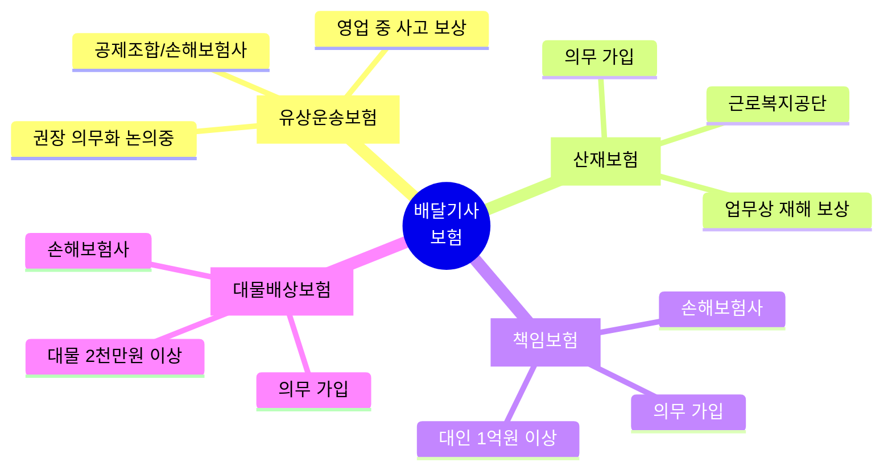

배달 일 시작하려는데 보험을 어떻게 가입해야 할지 막막하죠? 배달기사는 일반 자동차 보험과 달리 특별한 보험에 가입해야 해요. 어떤 보험이 필요하고 어디서 가입하는지 알려드릴게요.

## 배달기사 보험 종류는 뭐가 있나요?

**배달기사는 유상운송보험, 산재보험, 책임보험, 대물배상보험 4가지를 가입해야 해요.**

첫째, 유상운송보험은 돈을 받고 배달하는 중 생긴 사고를 보상받는 보험이에요. 배달 끝나고 돌아오는 길 사고도 보장돼요. 가정용 이륜차 보험으로는 영업 중 사고를 보상받을 수 없어서 꼭 필요해요. 둘째, 산재보험은 배달 중 다치거나 병에 걸리면 치료비와 휴업급여를 받을 수 있는 보험이에요. [배달앱종사자 산재보험 안내](https://easylaw.go.kr/CSP/CnpClsMain.laf?popMenu=ov&csmSeq=1589&ccfNo=2&cciNo=1&cnpClsNo=2)에서 자세히 확인하세요. 셋째, 책임보험은 배달 중 사고로 다른 사람이 다치거나 사망하면 1명당 1억원 이상 보상하는 보험이에요. 넷째, 대물배상보험은 다른 사람 재산을 망가뜨렸을 때 사고 1건당 2천만원까지 보상해요.

## 배달기사 가입 방법은 어떻게 되나요?

**유상운송보험은 배달서비스공제조합이나 손해보험사에서 가입할 수 있어요.**

유상운송보험은 [배달서비스공제조합](https://www.deliveryservice.or.kr/)에서 가입하거나, 삼성화재, DB손해보험 같은 손해보험사에서 가입할 수 있어요. 온라인이나 전화로 신청하면 되고, 시간제와 종일제 중 선택할 수 있어요. 산재보험은 배달 플랫폼 회사나 대행사에서 일괄로 가입해주는 경우가 많아요. 만약 회사가 안 해줬다면 근로복지공단(☎ 1588-0075)에 문의해서 직접 가입할 수 있어요. 책임보험과 대물배상보험도 손해보험사에서 함께 가입하면 편해요. 2026년 1분기부터는 만 21세 이상 배달기사도 시간제보험에 가입할 수 있도록 제도가 개선돼요.

## 배달기사 보험 기본 규정은 뭔가요?

**소화물배송대행서비스 인증사업자는 책임보험 가입이 의무예요.**

배달 대행사나 플랫폼 회사가 정부 인증을 받았다면 반드시 책임보험에 가입해야 해요. 자동차 운행으로 다른 사람이 다치거나 사망하면 1명당 1억원 이상, 재물 손해는 사고당 2천만원 이상 보상하는 보험이나 공제에 가입해야 하는 게 기본 규정이에요. [배달앱종사자 보험 안내](https://easylaw.go.kr/CSP/CnpClsMain.laf?popMenu=ov&csmSeq=1589&ccfNo=1&cciNo=1&cnpClsNo=1)에서 법적 근거를 확인할 수 있어요. 유상운송보험은 아직 의무는 아니지만 2024년 12월 법안이 발의돼서 곧 의무화될 가능성이 높아요. 현재 전업 배달기사 중 유상운송보험 가입률은 40%밖에 안 돼요. 사고 나면 큰 손해 보니까 미리 가입하는 게 안전해요.

## 배달기사 보험 관련 최신 변화는 뭐가 있나요?

**2026년부터 위험도에 맞는 보험료 체계로 바뀌어서 최대 30% 인하돼요.**

금융감독원이 이륜차 유상운송보험 제도를 개선해서 2026년 1분기부터 순차적으로 시행돼요. 위험도에 맞게 보험료를 내면 만 21세 이상 배달기사도 시간제보험에 가입할 수 있고, 보험료도 최대 30%까지 낮아져요. 지금까지는 나이나 경력 상관없이 비슷한 보험료를 냈는데, 앞으로는 안전하게 운전하는 사람은 더 싸게 낼 수 있는 거예요. 또 유상운송보험 의무화 법안이 국회에서 논의 중이라 조만간 의무 가입으로 바뀔 수도 있어요. 무보험 배달기사 비율이 60%나 되는 상황이라 정부가 강하게 추진하고 있거든요. [배달기사 산재보험 유지 휴업](/w/배달기사-산재보험-유지-휴업)도 함께 알아두면 좋아요.

<a href="https://www.deliveryservice.or.kr/" target="_blank" rel="noopener noreferrer" class="ext-btn ext-btn-green">
  배달서비스공제조합 공식
  유상운송보험 가입
  가입하기 →
</a>

## 출처

- [배달앱종사자 보험 안내](https://easylaw.go.kr/CSP/CnpClsMain.laf?popMenu=ov&csmSeq=1589&ccfNo=1&cciNo=1&cnpClsNo=1) - 찾기쉬운 생활법령정보
- [배달서비스공제조합](https://www.deliveryservice.or.kr/) - 배달서비스공제조합
- [배달라이더 이륜차보험 개선 안내](https://www.insjournal.co.kr/news/articleView.html?idxno=29346) - 보험저널
