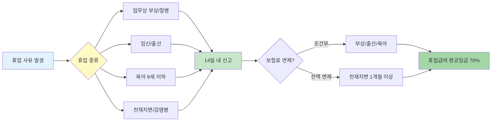

배달 중 사고로 다쳐서 한 달 쉬어야 하는데 보험이 끊기면 어쩌죠? 걱정 마세요. 배달기사도 산재보험을 유지하면서 휴업할 수 있어요. 어떤 경우에 가능한지, 어떻게 신청하는지 알려드릴게요.

## 배달기사 보험 유지는 어떻게 하나요?

**휴업 사유가 생기면 14일 이내 근로복지공단에 신고하면 산재보험을 유지할 수 있어요.**

배달앱종사자가 부상, 질병, 출산, 육아 등으로 일을 못 하게 되면 사업주가 사유 발생일부터 14일 이내에 근로복지공단에 신고해야 해요. 사업주가 신고하지 않으면 배달기사가 직접 신고할 수도 있어요. [배달앱종사자 산재보험 안내](https://www.easylaw.go.kr/CSP/CnpClsMain.laf?csmSeq=1589&ccfNo=2&cciNo=1&cnpClsNo=2)에서 자세한 절차를 확인하세요. 신고하면 휴업 기간 동안 산재보험이 유지되고, 조건에 맞으면 휴업급여도 받을 수 있어요. 배달 플랫폼 회사나 대행사에 먼저 연락해서 휴업 사실을 알리는 게 중요해요.

## 배달기사 휴업 기간 기준은 뭔가요?

**부상, 출산, 육아 등 정당한 사유가 있으면 휴업 기간 제한 없이 보험을 유지할 수 있어요.**

업무상 부상이나 질병으로 치료가 필요하면 치료 기간 동안 계속 휴업할 수 있어요. 여성 배달기사는 임신이나 출산으로 쉬는 경우도 해당돼요. 또 8세 이하나 초등학교 2학년 이하 자녀를 키우기 위해 휴업하는 것도 인정돼요. [산업재해보상보험법](https://www.law.go.kr/LSW/lsLawLinkInfo.do?lsJoLnkSeq=1000521110&chrClsCd=010202)에서 이런 휴업 사유를 보장하고 있어요. 단, 휴업 기간이 길어지면 플랫폼과의 계약 조건을 확인해야 할 수도 있으니 주의하세요.

## 배달기사 휴업급여 기준은 어떻게 되나요?

**업무상 부상이나 질병으로 쉬면 평균임금의 70%를 휴업급여로 받아요.**

배달 중 사고로 다치거나 업무 때문에 병에 걸려서 요양하는 경우, 일하지 못한 기간에 대해 1일당 평균임금의 70%를 받을 수 있어요. 단, 3일 이내로 짧게 쉬는 건 제외돼요. 예를 들어 평균 일당이 10만원이면 하루에 7만원씩 휴업급여를 받는 거예요. 근로복지공단에 휴업급여를 신청하면 심사 후 지급돼요. 저소득 배달기사의 경우 최저임금 기준으로 계산되기도 하니, 본인 상황에 맞게 확인해야 해요. 근로복지공단(☎ 1588-0075)에 문의하면 정확한 금액을 알 수 있어요.

## 배달기사 산재보험 관련 주의사항은 뭐가 있나요?

**휴업 신고를 늦게 하거나 안 하면 휴업급여를 못 받을 수 있어요.**

휴업 사유가 생긴 날부터 14일 이내에 꼭 신고해야 해요. 신고가 늦으면 휴업급여 지급이 늦어지거나 아예 못 받을 수도 있거든요. 사업주가 신고 안 하면 배달기사가 직접 근로복지공단에 연락해서 신고할 수 있다는 점 기억하세요. 또 천재지변이나 코로나 같은 감염병으로 1개월 이상 일을 못 하게 되면 그 기간 보험료를 면제받을 수 있어요. 하지만 일반적인 휴업은 보험료가 계속 나갈 수 있으니 미리 확인하는 게 좋아요. [배달기사 보험 가입 종류](/w/배달기사-보험-가입-종류)도 함께 알아두면 도움이 돼요.

<a href="https://www.comwel.or.kr/comwel/html.do?menu_idx=111" target="_blank" rel="noopener noreferrer" class="ext-btn ext-btn-green">
  근로복지공단 공식
  산재보험 휴업급여 신청
  신청하기 →
</a>

## 출처

- [배달앱종사자 산재보험 안내](https://www.easylaw.go.kr/CSP/CnpClsMain.laf?csmSeq=1589&ccfNo=2&cciNo=1&cnpClsNo=2) - 찾기쉬운 생활법령정보
- [산업재해보상보험법](https://www.law.go.kr/LSW/lsLawLinkInfo.do?lsJoLnkSeq=1000521110&chrClsCd=010202) - 국가법령정보센터
- [산재보험 휴업급여 안내](https://easylaw.go.kr/CSP/CnpClsMain.laf?popMenu=ov&csmSeq=575&ccfNo=3&cciNo=1&cnpClsNo=1) - 찾기쉬운 생활법령정보
