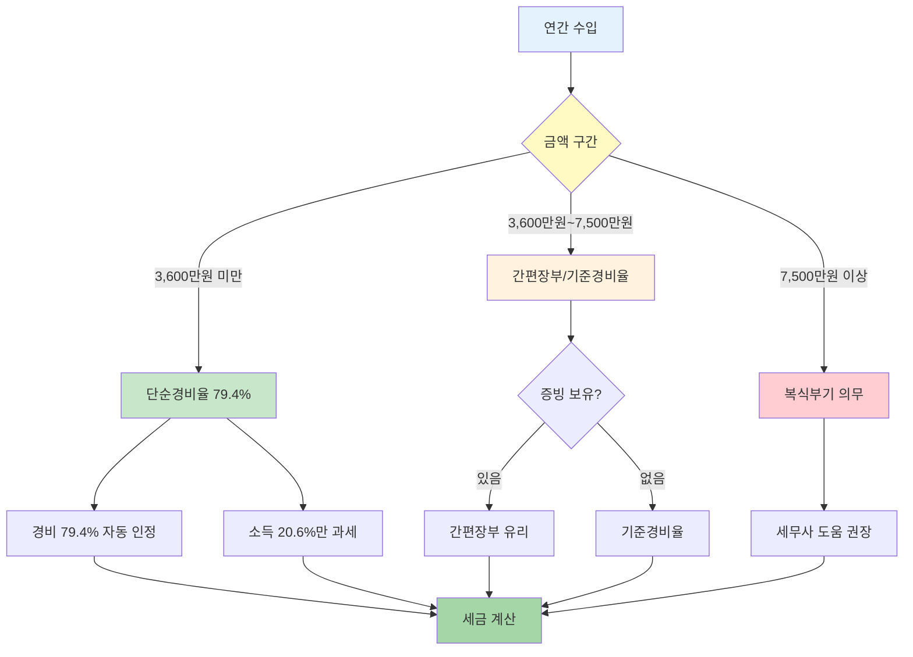
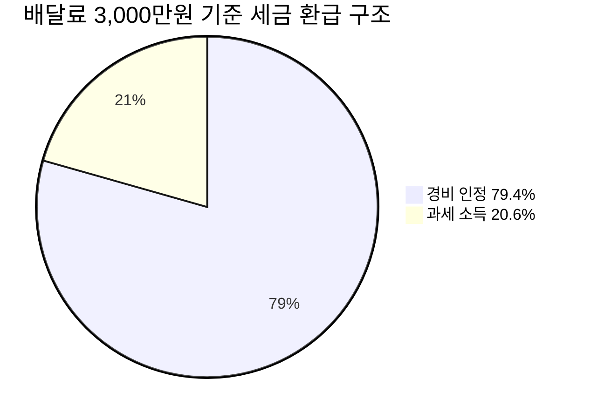

"배달 일 하면서 3.3% 떼이는데 세금 신고 해야 하나요?"

배달기사는 사업소득자예요. 매년 5월에 종합소득세 신고해야 하고, 신고하면 3.3% 중 일부를 돌려받을 수 있어요. 신고 방법과 기한 알려드릴게요.

## 배달기사 소득세 신고는 어떻게 하나요?

배달기사는 프리랜서와 같은 사업소득자로 분류돼요. 배민커넥트, 쿠팡이츠, 요기요 등에서 일하면서 3.3%를 원천징수당했다면 종합소득세 신고 대상이에요.

4대 보험 가입한 정규직 배달 직원이라면 연말정산으로 끝이에요. 회사에서 알아서 처리하니까 별도 신고 필요 없어요. 하지만 플랫폼을 통해 건당 배달료 받는 배달기사는 사업소득이라서 직접 신고해야 해요.

신고 방법은 세 가지예요.

- 홈택스에서 전자신고
- 손택스 모바일 앱으로 신고
- 세무대리인에게 맡기기

홈택스가 가장 많이 쓰는 방법이에요. [국세청 홈택스](https://www.hometax.go.kr)에 들어가서 공동인증서나 간편인증으로 로그인하면 돼요. 종합소득세 신고 메뉴에서 안내에 따라 입력하면 30분 안에 끝나요.

## 배달기사 신고 기한은 언제까지인가요?

매년 5월 1일부터 6월 2일까지예요. 이 기간 안에 전년도 소득을 신고하고 세금을 내야 해요.

2026년 기준으로 설명할게요. 2025년 1월부터 12월까지 번 배달료를 2026년 5월 1일부터 6월 2일 사이에 신고해요. 6월 2일 자정까지가 마감이니까 여유 있게 5월 중에 하는 게 좋아요.

마감일이 주말이면 다음 평일로 연장돼요. 2026년 6월 2일이 월요일이니까 그대로 6월 2일까지예요. 하루라도 늦으면 가산세가 붙으니까 주의하세요.

신고 기간 전에 홈택스에 로그인해서 소득 자료가 제대로 들어왔는지 미리 확인해보세요. 플랫폼 회사에서 신고 안 한 경우가 있거든요. 4월 말쯤 확인하면 충분해요.

## 배달기사 기본 규정은 뭔가요?

배달기사는 소득세법상 사업소득자예요. 사업소득자는 수입에서 경비를 빼고 남은 금액에 세금을 내요.

수입 금액에 따라 경비율이 달라져요.

원천징수 3.3%는 임시로 떼는 거예요. 실제 세금은 경비율 적용해서 다시 계산해요. 대부분 3.3%보다 적게 나와서 차액을 돌려받아요.

예를 들어볼게요. 2025년에 배달료로 3,000만 원 받았다면 3.3%인 99만 원을 원천징수당했어요. 단순경비율 79.4% 적용하면 실제 소득은 618만 원(3,000만 원 × 20.6%)이에요. 여기에 세율 적용하면 실제 세금은 50만 원 정도 나와요. 99만 원 냈으니까 49만 원을 돌려받는 거예요.

## 배달기사 관련 주의사항은 뭔가요?

첫 번째, 미신고 가산세예요. 신고 안 하면 무신고 가산세 20%가 붙어요. 원래 낼 세금에 20%를 더 내야 해요. 50만 원 낼 걸 안 냈으면 10만 원 추가로 내요.

두 번째, 납부지연 가산세예요. 신고는 했는데 세금을 안 냈거나 늦게 냈으면 하루당 0.022%씩 가산세가 붙어요. 한 달 늦으면 0.66%, 1년 늦으면 약 8%예요. 시간 지날수록 불어나니까 빨리 내야 해요.

세 번째, 세액공제를 못 받아요. 신고 안 하면 세액공제나 감면 혜택을 하나도 못 받아요. 경비율 적용도 못 받고 원천징수 3.3%를 그대로 세금으로 내야 해요. 신고만 하면 돌려받을 돈을 못 받는 거예요.

네 번째, 플랫폼 회사 확인이에요. 일부 배달 대행업체나 플랫폼이 3.3%를 떼고도 국세청에 신고 안 하는 경우가 있어요. 이러면 나중에 배달기사가 이중으로 세금 낼 수도 있어요. 신고 전에 홈택스에서 "지급명세서"를 확인해서 소득 자료가 제대로 들어왔는지 꼭 체크하세요.

다섯 번째, 증빙 자료 보관이에요. 오토바이 유류비, 수리비, 통신비 같은 경비 증빙을 모아두면 세금을 더 줄일 수 있어요. 3,600만 원 넘으면 간편장부 쓸 수 있으니까 영수증 잘 챙기세요.

<a href="https://www.hometax.go.kr/websquare/websquare.html?w2xPath=/ui/pp/index_pp.xml" target="_blank" rel="noopener noreferrer" class="ext-btn ext-btn-green">
  국세청 공식
  홈택스 종합소득세 신고
  신고하기 →
</a>

## 출처

- [국세청 홈택스](https://www.hometax.go.kr) - 종합소득세 신고
- [국세청 종합소득세 안내](https://www.nts.go.kr) - 신고 안내
- [배달 라이더 종합소득세 가이드](https://blog.toss.im/article/tossmoment-1) - 토스피드

## 관련 문서

- [종합소득세 신고 방법](/w/종합소득세-신고-방법)
- [사업소득 경비율](/w/사업소득-경비율)
- [프리랜서 세금 신고](/w/프리랜서-세금-신고)
