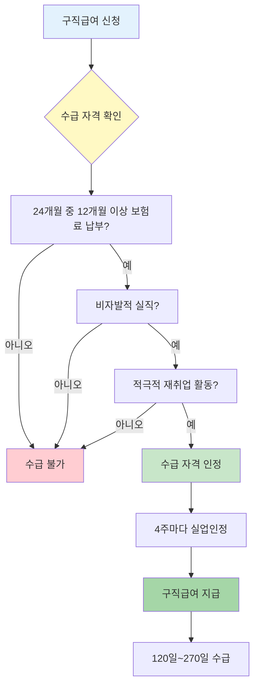

배달앱으로 일하다 그만뒀어요. 생계가 막막하죠? 고용보험 가입했다면 구직급여를 받을 수 있어요. 배달기사도 플랫폼 노무제공자로 인정돼서 실업급여 대상이에요. 조건과 방법 알려드릴게요.

## 배달앱 플랫폼 근로자는 누구인가요?

**배달앱을 통해 배송서비스를 제공하는 배달기사를 말해요. 고용보험법상 플랫폼 노무제공자로 인정돼요.**

배달앱을 이용한 배송대행서비스를 제공하는 배달기사는 [고용보험법](https://www.law.go.kr/법령/고용보험법)상 "플랫폼 노무제공자"에 해당해요. 쿠팡이츠, 배달의민족, 요기요 같은 플랫폼을 통해 일하는 배달기사가 여기 포함돼요. 프리랜서, 특수고용직, 초단시간 근로자도 모두 고용보험 적용 대상이에요. 정규직이 아니어도 고용보험에 가입하면 실직 시 구직급여를 받을 수 있어요. [찾기쉬운 생활법령정보](https://easylaw.go.kr/CSP/CnpClsMain.laf?csmSeq=1589&ccfNo=1&cciNo=1&cnpClsNo=1)에서 자세한 내용을 확인하세요.

## 배달앱 급여 수급 조건은 뭔가요?

**이직 전 24개월 중 12개월 이상 보험료를 납부하고, 비자발적 실직이어야 해요.**

플랫폼종사자는 실직일 전 24개월 중 12개월 이상 보험료를 납부했어야 구직급여를 받을 수 있어요. 실직 사유가 자발적 이직 등 수급자격 제한 사유가 아니어야 하고, 적극적으로 재취업 활동을 해야 해요. 다른 노동자와 같이 120일부터 270일까지 구직급여를 받을 수 있어요. 고용보험료는 월 수입의 1.4%를 배달기사와 플랫폼이 절반씩 부담해요. 예를 들어 월 200만원 벌었다면 고용보험료는 2만 8,000원이고, 배달기사와 플랫폼이 각각 1만 4,000원씩 내요. [고용보험 가입 확인](/w/고용보험-가입-확인)은 고용보험 홈페이지에서 할 수 있어요.

## 배달앱 신청 방법은 어떻게 되나요?

**가까운 고용센터 방문하거나 고용보험 홈페이지에서 온라인 신청하면 돼요.**

실직한 날로부터 빠르게 신청해야 해요. 늦으면 그만큼 받는 기간이 줄어들거든요. 신청할 때 필요한 서류는 이직확인서, 신분증, 통장사본이에요. 이직확인서는 플랫폼 회사에 요청하면 받을 수 있어요. 온라인 신청은 [고용보험 홈페이지](https://www.ei.go.kr)에서 가능하고, 고용센터 방문 신청도 돼요. 신청하면 14일 이내에 수급자격 인정 여부가 나와요. 인정되면 실업인정을 받은 뒤 4주마다 구직급여가 지급돼요. [실업급여 신청 방법](/w/실업급여-신청)에서 자세한 절차를 확인하세요.

## 배달앱 관련 주의사항은 뭔가요?

**2026년부터 반복 수급자는 급여가 최대 50%까지 삭감되고, 대기기간도 최대 4주까지 늘어나요.**

2026년부터 실업급여 제도가 강화됐어요. 5년 동안 3회 이상 구직급여를 신청하는 반복 수급자는 급여액이 최대 50%까지 삭감될 수 있어요. 실업급여 받기 전 대기기간도 기존 1주에서 최대 4주까지 늘어났어요. 2026년 기준 실업급여 하루 하한액은 6만 6,048원, 상한액은 6만 8,100원이에요. 월 최대 204만원까지 받을 수 있어요. 실직 전 평균임금의 60%를 기준으로 계산하되, 이 범위 안에서 지급돼요. 부정수급하면 받은 금액의 5배를 토해내야 하니 절대 거짓으로 신청하면 안 돼요. 자세한 문의는 고용노동부 고객상담센터(1350)로 전화하세요.

<a href="https://www.ei.go.kr/ei/eih/eg/pb/pbPersonBnef/retrievePb0201Info.do" target="_blank" rel="noopener noreferrer" class="ext-btn ext-btn-green">
  고용보험 공식
  실업급여 인터넷 신청
  신청하기 →
</a>

## 출처

- [고용보험법](https://www.law.go.kr/법령/고용보험법) - 법제처
- [플랫폼 노무제공자](https://easylaw.go.kr/CSP/CnpClsMain.laf?csmSeq=1589&ccfNo=1&cciNo=1&cnpClsNo=1) - 찾기쉬운 생활법령정보
- [고용노동부](https://www.moel.go.kr) - 고용노동부
- [고용보험 홈페이지](https://www.ei.go.kr) - 고용보험
