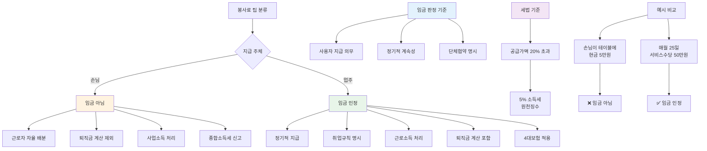

"레스토랑에서 손님한테 팁 받았는데 이것도 월급이에요?"

아니에요. 손님이 직접 주는 봉사료는 근로기준법상 임금이 아니에요. 하지만 업주가 정기적으로 지급하면 임금이 될 수 있어요. 헷갈리는 봉사료와 팁의 법적 기준을 알려드릴게요.

## 봉사료 팁 분류는 어떻게 되나요?

**손님이 직접 주는지, 업주가 월급처럼 주는지로 나눠요.**

봉사료와 팁은 누가 지급하느냐에 따라 완전히 달라져요. 손님이 테이블에 현금을 놓고 가거나 카드 결제할 때 팁을 추가하면 이건 임금이 아니에요. 근로자들이 자율적으로 나눠 갖는 거예요.

반대로 업주가 매달 정해진 날짜에 "봉사료"라는 이름으로 지급하면 이건 임금이에요. 월급처럼 계속적이고 정기적으로 받으니까요. [근로기준법 제2조](https://www.law.go.kr/법령/근로기준법)에서 임금은 사용자가 근로의 대가로 지급하는 모든 금품이라고 정하고 있어요.

**손님이 주는 봉사료**
- 임금 아님
- 근로자들이 자율 배분
- 퇴직금 계산 제외
- 사업소득 처리

**업주가 정기 지급하는 봉사료**
- 임금 인정
- 근로소득 처리
- 퇴직금 계산 포함
- 4대보험 적용

## 봉사료 임금 판정 기준은 뭔가요?

**사용자가 지급 의무를 지느냐가 핵심이에요.**

대법원 판례에 따르면 카지노 손님이 직접 직원에게 준 봉사료를 근로자들끼리 나눈 경우 임금으로 보지 않아요. 업주가 지급한 게 아니고 손님이 임의로 준 거니까요.

임금으로 인정받으려면 세 가지 조건이 필요해요. 첫째 사용자가 지급해야 해요. 둘째 정기적으로 계속 받아야 해요. 셋째 단체협약이나 취업규칙에 명시돼야 해요. 이 조건 중 하나라도 안 맞으면 임금이 아니에요.

예를 들어볼게요. 호텔 식당 직원이 매달 25일에 "서비스 수당"이라는 명목으로 50만원씩 받아요. 취업규칙에도 명시돼 있고요. 이건 임금이에요. 반면 손님이 기분 좋아서 개인적으로 만원짜리 쥐어준 건 임금 아니에요.

## 봉사료 법적 기준은 어떻게 되나요?

**공급가액의 20% 넘으면 세금 원천징수해야 해요.**

세법에서는 봉사료를 따로 관리해요. 레스토랑이나 호텔에서 음식값과 별도로 봉사료를 받잖아요. 이게 공급가액의 20%를 넘으면 사업주가 5% 소득세를 떼고 지급해야 해요.

예를 들어 음식값이 10만원인데 봉사료가 2만원이면 딱 20%예요. 이 정도면 괜찮아요. 근데 봉사료가 3만원이면 20%를 초과하니까 3만원에서 5%인 1,500원을 세금으로 떼야 해요.

직원 입장에서는 봉사료가 사업소득이에요. 근로소득이 아니라요. 그래서 다음 해 5월에 종합소득세 신고할 때 따로 신고해야 해요. 업주가 원천징수 안 한 봉사료를 받았다면 꼭 신고하세요. 안 하면 무신고 가산세가 붙어요.

[찾기쉬운 생활법령정보](https://www.easylaw.go.kr/CSP/CnpClsMain.laf?csmSeq=1694&ccfNo=1&cciNo=1&cnpClsNo=1)에서 임금 판단 기준을 자세히 확인할 수 있어요.

## 봉사료 관련 주의사항은 뭔가요?

**퇴직금과 4대보험 계산이 달라져요.**

봉사료가 임금이냐 아니냐에 따라 받는 돈이 크게 달라져요. 임금으로 인정받으면 평균임금 계산에 포함돼서 퇴직금이 늘어나요. 4대보험도 봉사료 포함해서 계산하니까 나중에 실업급여나 국민연금 받을 때 유리해요.

반대로 손님이 직접 준 봉사료는 임금 아니니까 퇴직금 계산에서 빠져요. 1년에 봉사료로 600만원 받았어도 퇴직금엔 하나도 안 들어가요. 그래서 근로계약서 쓸 때 봉사료를 어떻게 처리하는지 꼭 확인하세요.

실제 사례예요. A씨는 호텔 식당에서 월급 250만원에 봉사료 평균 50만원씩 받았어요. 3년 근무 후 퇴직할 때 업주가 "봉사료는 손님이 준 거라 퇴직금 계산 안 된다"고 했어요. 근데 취업규칙 보니까 "매월 봉사료 지급"이라고 명시돼 있었어요. 결국 봉사료 포함해서 평균임금 계산하고 퇴직금 450만원을 더 받았어요.

**확인해야 할 것**
- 근로계약서에 봉사료 명시 여부
- 취업규칙 봉사료 규정 확인
- 봉사료 지급 주체 파악
- 세금 원천징수 여부 확인

세금 처리도 조심해야 해요. 업주가 봉사료 지급대장을 안 만들거나 세금을 안 떼면 나중에 직원한테 세금 폭탄이 올 수 있어요. 봉사료 받을 때 원천징수 영수증 받아두세요. [근로소득과 사업소득의 차이](/w/근로소득-사업소득)도 알아두면 도움돼요.

---

## 출처

- [근로기준법](https://www.law.go.kr/법령/근로기준법) - 법제처
- [찾기쉬운 생활법령정보](https://www.easylaw.go.kr/CSP/CnpClsMain.laf?csmSeq=1694&ccfNo=1&cciNo=1&cnpClsNo=1) - 법제처

---

## 관련 문서

- [퇴직금 계산 방법](/w/퇴직금-계산)
- [근로소득 사업소득 차이](/w/근로소득-사업소득)
- [평균임금 계산](/w/평균임금-계산)
