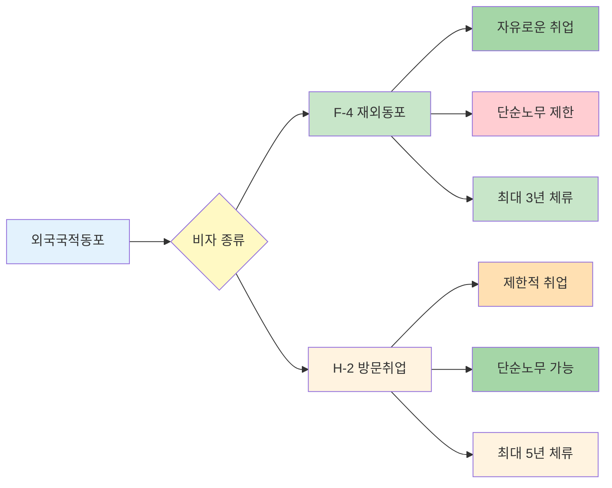

"미국 시민권자인데 한국에서 일하고 싶어요. 어떤 비자가 필요한가요?"

외국국적동포라면 F-4 재외동포 비자로 한국에서 자유롭게 취업할 수 있어요. 일반 외국인 근로자와 달리 직종 제한이 거의 없고, 체류기간도 길어요. 어떤 사람이 받을 수 있고, 어떻게 신청하는지 알려드릴게요.

## 외국국적동포 동포 취업은 어떻게 하나요?

**F-4 재외동포 비자를 받으면 단순노무를 제외한 모든 직종에서 일할 수 있어요.**

외국국적동포는 외국 국적을 가진 한국계 동포를 말해요. 과거 한국 국적을 가졌던 사람이나 부모·조부모 중 한 분이 한국인이었던 사람이 해당돼요. [재외동포의 출입국과 법적지위에 관한 법률](https://www.law.go.kr/법령/재외동포의출입국과법적지위에관한법률)에서 이 자격을 인정하고 있어요.

F-4 비자를 받으면 사회질서나 경제안정을 해치지 않는 범위에서 자유롭게 취업하거나 경제활동을 할 수 있어요. 회사원, 자영업, 프리랜서 모두 가능해요. 다만 단순노무는 원칙적으로 제한돼요. 하지만 인구감소지역에서 거주하거나 취업하는 경우에는 법무부장관이 인정하면 단순노무도 할 수 있어요.

일반 외국인 근로자가 받는 E-9 비자와 비교하면 훨씬 자유로워요. E-9 비자는 정해진 사업장에서만 일할 수 있고 직종도 제한적이지만, F-4는 직장 이동도 자유롭고 창업도 할 수 있어요.

## 외국국적동포 제도 설명이 궁금해요

**외국국적동포는 한국계 외국인을 위한 특별 체류자격이에요.**

외국국적동포 제도는 해외에 사는 한국계 동포들이 모국에서 쉽게 생활하고 일할 수 있도록 만든 제도예요. 1999년 재외동포법이 만들어지면서 시작됐고, 2019년에 크게 개선됐어요.

2019년 이전에는 3세대까지만 F-4 비자를 받을 수 있었어요. 하지만 지금은 4세대 이후 동포도 F-4 비자를 받을 수 있어요. 다만 한국어 능력을 증명해야 하고, 해외 범죄경력 서류도 제출해야 해요.

F-4 비자의 가장 큰 장점은 체류기간이에요. 직계가족이 한국인이었던 경우 최대 2년, 통합 신청하면 3년까지 체류할 수 있어요. 체류기간이 끝나면 연장도 가능해요. 또한 국내거소증을 발급받으면 은행계좌 개설, 의료보험 가입, 신용카드 발급, 운전면허증 취득 등을 주민등록증처럼 편하게 할 수 있어요.

[외국인근로자 고용허가제](/w/외국인근로자-고용허가제)와 비교하면 차이가 명확해요. 고용허가제는 특정 사업장에 묶여 있고, 사업장 변경도 제한적이에요. 하지만 F-4는 자유롭게 이직하고 창업할 수 있어요.

## 외국국적동포 신청 방법은 어떻게 되나요?

**해외 한국 영사관이나 한국 출입국관리사무소에서 신청할 수 있어요.**

해외에서 신청하는 방법과 한국에서 신청하는 방법이 있어요. 해외에서 신청하려면 거주 국가의 한국 영사관이나 총영사관을 방문하면 돼요. 우편 접수는 안 되고, 반드시 직접 방문하거나 순회영사 때 접수해야 해요.

필수 서류는 사증발급신청서, 유효한 외국 여권, 시민권증서 원본 및 사본, 기본증명서 또는 제적등본이에요. 과거 한국 국적이 있었다면 국적상실신고 접수증만 있어도 진행할 수 있어요. 추가로 해외범죄경력확인서(미국의 경우 FBI 범죄경력확인서)와 한국어 능력 입증서류가 필요해요.

한국어 능력 증명은 토픽(TOPIK) 시험 성적표나 사회통합프로그램 이수증으로 하면 돼요. 다만 과거 한국 국적을 가졌던 사람, 60세 이상, 13세 이하는 면제돼요. 범죄경력 확인도 60세 이상, 13세 이하, 국가유공자와 유족은 면제예요.

한국에서 신청하는 방법도 있어요. 한국에 입국한 후 90일 이내에 관할 출입국관리사무소에서 F-4 비자와 거소증을 통합 신청할 수 있어요. 이 경우 체류기간이 3년으로 더 길어요.

<a href="https://www.hikorea.go.kr" target="_blank" rel="noopener noreferrer" class="ext-btn ext-btn-green">
  하이코리아 공식
  재외동포 비자 신청
  신청하기 →
</a>

## 외국국적동포 관련 주의사항은 뭔가요?

**단순노무 제한과 한국어 능력 요건을 꼭 확인하세요.**

F-4 비자의 가장 큰 제한은 단순노무예요. 제조업 생산직, 건설 현장 노무직, 농축산업 단순 작업 같은 일은 원칙적으로 할 수 없어요. 선량한 풍속이나 사회질서에 반하는 행위도 금지돼요. 만약 이런 제한을 어기면 비자가 취소될 수 있어요.

다만 인구감소지역에서는 예외예요. 법무부장관이 인정하면 단순노무도 할 수 있어요. 인구감소지역은 주로 지방 소도시나 농어촌 지역이에요. 해당 지역에서 일하고 싶다면 출입국관리사무소에 문의해보세요.

한국어 능력 요건도 중요해요. 2019년부터 4세대 이후 동포는 한국어 능력을 증명해야 F-4 비자를 받을 수 있어요. 토픽 1급 이상이거나 사회통합프로그램 중급 이상 이수가 필요해요. 준비 기간이 필요하니 미리 시험을 봐두는 게 좋아요.

거소증 발급도 고려하세요. 거소증이 없어도 한국에서 생활할 수는 있지만, 은행 계좌 개설이나 휴대폰 개통 같은 일상적인 일들이 어려워요. F-4 비자를 받으면 입국 후 90일 이내에 거소증을 신청하는 게 편해요. [외국인근로자 근무처 변경](/w/외국인근로자-근무처-변경)도 참고하면 도움이 될 거예요.

---

## 출처

- [재외동포의 출입국과 법적지위에 관한 법률](https://www.law.go.kr/법령/재외동포의출입국과법적지위에관한법률) - 법제처
- [찾기쉬운 생활법령정보 - 재외동포](https://easylaw.go.kr/CSP/CnpClsMain.laf?popMenu=ov&csmSeq=1136&ccfNo=3&cciNo=3&cnpClsNo=1) - 법제처
- [하이코리아](https://www.hikorea.go.kr) - 출입국·외국인정책본부

---

## 관련 문서

- [외국인근로자 고용허가제](/w/외국인근로자-고용허가제)
- [외국인근로자 근무처 변경](/w/외국인근로자-근무처-변경)
