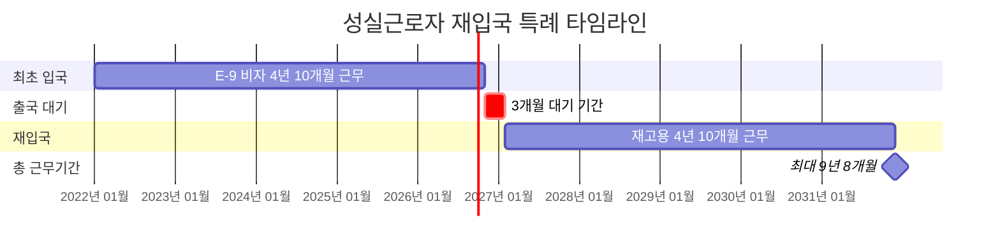

"E-9 비자로 4년 넘게 일했어요. 계속 일하고 싶은데 어떻게 하나요?"

성실근로자 재입국 특례를 쓰면 돼요. 3개월만 나갔다 오면 다시 일할 수 있어요. 조건과 절차 알려드릴게요.

## 외국인근로자 재입국 제도가 뭔가요?

**성실하게 일한 외국인근로자가 출국 후 빨리 다시 입국해서 일할 수 있는 제도예요.**

일반적으로 E-9 비자는 4년 10개월까지만 일할 수 있어요. 더 일하려면 한 번 나갔다가 다시 와야 하는데, 보통은 6개월 기다려야 하고 한국어 시험도 다시 봐야 해요.

하지만 성실근로자 재입국 특례를 받으면 3개월만 기다리면 돼요. 한국어 시험이나 취업 교육도 면제돼요. [찾기쉬운 생활법령정보](https://easylaw.go.kr/CSP/CnpClsMain.laf?popMenu=ov&csmSeq=2042&ccfNo=3&cciNo=2&cnpClsNo=3)에서 자세한 내용을 확인할 수 있어요.

**재입국 특례 혜택:**
- 출국 후 3개월이면 재입국 가능해요
- 한국어 시험 면제돼요
- 취업 교육 면제돼요
- 내국인 구인 절차 면제돼요
- 고용주 변경 없이 바로 같은 회사로 복귀 가능해요

2012년 7월부터 시행된 제도로, 숙련된 외국인근로자를 계속 고용할 수 있게 만든 거예요.

## 외국인근로자 재입국 신청 조건은 뭔가요?

**사업장 변경 없이 4년 10개월 근무해야 해요.**

성실근로자로 인정받으려면 까다로운 조건이 있어요. 한 직장에서 오래 성실하게 일했다는 증거가 필요해요.

**필수 조건:**
- E-9 비자로 4년 10개월 근무 완료해야 해요
- 사업장 변경 이력이 없어야 해요 (한 직장에서 쭉 근무)
- 제조업은 50인 이하 사업장이어야 해요
- 농축산업, 어업, 서비스업은 사업장 규모 제한 없어요
- 임금 체불이나 산재보험 미가입 같은 문제가 없어야 해요

**예외 조건:**
- 회사 폐업이나 휴업으로 어쩔 수 없이 사업장 변경한 경우예요
- 이 경우 마지막 사업장에서 최소 1년 이상 근무해야 해요
- 근로자 귀책사유가 아닌 변경이어야 인정돼요

사업장 변경이 1번이라도 있으면 원칙적으로 특례를 못 받아요. 하지만 회사가 망하거나 산재로 일을 못하게 된 경우처럼 본인 잘못이 아니면 예외로 인정될 수 있어요.

## 외국인근로자 재입국 절차는 어떻게 되나요?

**출국 전에 고용주가 재고용 신청해야 해요.**

재입국 특례를 받으려면 출국 전에 준비를 다 끝내야 해요. 출국한 다음에는 신청할 수 없으니까 주의하세요.

**1단계: 출국 전 준비 (고용주가 해야 할 일)**
- 근로자 출국 전에 고용센터에 재고용 허가 신청해요
- 성실근로 확인서를 받아요
- 근로계약서를 작성해요
- 출국 전에 재입국 고용허가서를 받아요

**2단계: 출국 후 대기**
- 근로자는 본국으로 출국해요
- 3개월 대기해요 (일반 재입국은 6개월)
- 이 기간 동안 고용주는 재입국 비자 발급 준비해요

**3단계: 재입국 및 취업**
- 3개월 후 주한 대사관에서 E-9 비자 발급받아요
- 한국 재입국해요
- 한국어 시험이나 취업 교육 없이 바로 일 시작해요
- 다시 4년 10개월 근무 가능해요

신청 기간이 중요해요. 고용주는 근로자 출국 전에 신청해야 하고, 출국 후에는 3개월만 기다리면 돼요. [고용노동부 외국인력센터](https://eps.hrdkorea.or.kr)에서 신청 절차를 자세히 안내받을 수 있어요.

## 외국인근로자 재입국 관련 주의사항은요?

**재입국 특례는 1번만 사용 가능해요.**

재입국 특례로 다시 한국에 와서 4년 10개월 일하면 끝이에요. 그 다음에는 일반 절차로 출국하고 6개월 기다려야 해요.

**재입국 특례 총정리:**
- 최초 입국: 4년 10개월 근무
- 출국: 3개월 대기
- 재입국: 4년 10개월 근무
- 총 근무 기간: 최대 9년 8개월

**장기근속 특례 (계획 중):**
- 2023년 고용노동부가 발표한 새로운 제도예요
- 출국 없이 10년 연속 근무 가능하게 만드는 거예요
- 아직 법 개정이 안 돼서 시행 전이에요
- 국회에서 법이 통과되면 적용될 예정이에요

**재입국 실패 사유:**
- 사업장 변경 이력이 있는 경우
- 임금 체불이나 산재보험 미가입이 있는 경우
- 불법 체류나 범법 행위가 있는 경우
- 근로계약 위반으로 강제 출국당한 경우

재입국 특례를 받으려면 4년 10개월 동안 정말 성실하게 일해야 해요. 무단결근이나 근로계약 위반 같은 문제가 없어야 인정받을 수 있어요.

<a href="https://eps.hrdkorea.or.kr/e9/user/employment/employment.do?method=employGuidLabor" target="_blank" rel="noopener noreferrer" class="ext-btn ext-btn-green">
  고용노동부 공식
  외국인 고용허가제 안내
  확인하기 →
</a>

## 출처

- [찾기쉬운 생활법령정보 - 재입국 취업](https://easylaw.go.kr/CSP/CnpClsMain.laf?popMenu=ov&csmSeq=2042&ccfNo=3&cciNo=2&cnpClsNo=3) - 법제처
- [고용노동부 - 외국인근로자 재입국 특례](https://www.moel.go.kr/news/enews/report/enewsView.do?news_seq=12802) - 고용노동부
- [고용노동부 외국인력센터](https://eps.hrdkorea.or.kr/e9/user/employment/employment.do?method=employGuidLabor) - 한국산업인력공단
- [숙련 외국인근로자 10년 체류 가능](https://www.korea.kr/news/policyNewsView.do?newsId=148909976) - 대한민국 정책브리핑
