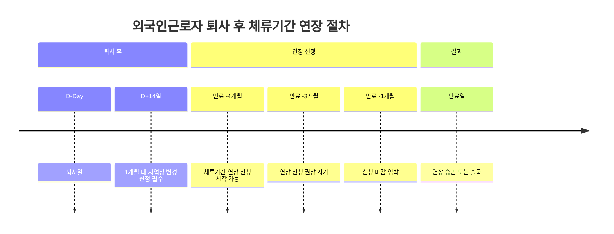

"E-9 비자로 일하다가 회사를 그만뒀어요. 바로 나가야 하나요?"

아니에요. 1개월 안에 새 직장을 구하면 계속 일할 수 있어요. 체류 연장 조건과 신청 방법 알려드릴게요.

## 외국인근로자 체류 연장은 언제 신청하나요?

**체류기간 만료 4개월 전부터 만료일까지 신청 가능해요.**

E-9 비자나 H-2 비자를 가진 외국인근로자는 체류기간이 끝나기 전에 연장 신청을 해야 해요. 너무 일찍 신청하면 안 되고, 만료 4개월 전부터 신청할 수 있어요. 만료일이 지나서 신청하면 과태료가 나와요.

[출입국관리법](https://www.law.go.kr/LSW/lsInfoP.do?lsiSeq=62471)에 따르면, 체류기간을 넘어서 계속 일하면 최대 3년 징역이나 3천만 원 이하 벌금을 받을 수 있어요. 그러니까 꼭 기간 안에 신청하세요.

신청은 관할 출입국·외국인청에 방문하거나 [하이코리아](https://www.hikorea.go.kr)에서 방문 예약 신청할 수 있어요. 외국인종합안내센터 1345로 전화해도 상담받을 수 있어요.

## 외국인근로자 신청 조건은 뭔가요?

**고용주가 고용 연장 확인서를 받아야 해요.**

체류기간을 연장하려면 먼저 고용주가 고용노동부에서 고용 연장 확인을 받아야 해요. 그래야 외국인근로자가 출입국청에서 체류 연장 허가를 받을 수 있어요.

**E-9 비자 기본 조건:**
- 최초 입국 후 4년 10개월까지 체류 가능해요
- 근로계약 기간이 남아있어야 해요
- 사업장이 정상적으로 운영되고 있어야 해요
- 임금 체불이나 산재보험 미가입 같은 문제가 없어야 해요

**재고용 특례 조건:**
- 최초 입국 후 4년 10개월 근무 완료해야 해요
- 출국 후 재입국하면 최대 4년 10개월 추가 근무 가능해요
- 총 최대 9년 8개월까지 일할 수 있어요

성실근로자는 출국 없이 바로 재고용되는 특례도 있어요. 자세한 내용은 [고용노동부 외국인력 정책](https://eps.hrdkorea.or.kr)에서 확인하세요.

## 외국인근로자 퇴사 후 절차는 어떻게 되나요?

**퇴사일로부터 1개월 안에 사업장 변경 신청해야 해요.**

회사를 그만두면 바로 나가는 게 아니에요. 1개월이라는 구직 기간이 주어져요. 이 기간 안에 새로운 사업장으로 변경 신청을 하면 계속 일할 수 있어요.

**퇴사 후 해야 할 일:**
- 퇴사일로부터 1개월 안에 고용센터에 사업장 변경 신청해요
- 고용센터에서 변경 허가를 받아요
- 새 고용주와 근로계약 체결해요
- 출입국청에서 사업장 변경 허가를 받아요

1개월 안에 사업장 변경 신청을 안 하면 출국해야 해요. 불법 체류가 되면 나중에 다시 입국할 때 불이익을 받을 수 있으니까 꼭 기간을 지키세요.

사업장 변경은 최초 입국 후 3회까지, 재고용 후에는 2회까지 가능해요. 정당한 사유 없이 너무 자주 직장을 옮기면 나중에 제한받을 수 있어요.

## 외국인근로자 체류 연장 관련 주의사항은요?

**체류기간 만료 후 신청하면 과태료가 나와요.**

체류기간이 지나서 신청하면 과태료를 내야 해요. 하루만 늦어도 과태료가 부과되니까 여유 있게 신청하세요. 만료 3개월 전쯤 신청하는 게 가장 안전해요.

**불법 체류 페널티:**
- 최대 3년 징역 또는 3천만 원 이하 벌금이에요
- 출국 후 재입국 제한될 수 있어요
- 한국에서 일할 기회를 영구적으로 잃을 수도 있어요

**사업장 변경 제한:**
- 최초 입국 후 3회까지만 사업장 변경 가능해요
- 재고용 후에는 2회까지만 변경 가능해요
- 정당한 사유 없는 잦은 변경은 불이익 받아요

체류 연장 신청할 때 필요한 서류는 출입국청마다 조금씩 달라요. 신청 전에 관할 출입국청이나 1345로 전화해서 정확한 서류 목록을 확인하세요.

<a href="https://www.hikorea.go.kr/info/InfoDatail.pt?CAT_SEQ=181&PARENT_ID=140" target="_blank" rel="noopener noreferrer" class="ext-btn ext-btn-green">
  하이코리아 공식
  체류기간 연장 신청
  신청하기 →
</a>

## 출처

- [찾기쉬운 생활법령정보 - 외국인근로자 체류](https://easylaw.go.kr/CSP/CnpClsMain.laf?popMenu=ov&csmSeq=2042&ccfNo=4&cciNo=1&cnpClsNo=2) - 법제처
- [정부24 - 체류기간연장허가](https://www.gov.kr/mw/AA020InfoCappView.do?CappBizCD=12700000097) - 정부24
- [출입국관리법](https://www.law.go.kr/LSW/lsInfoP.do?lsiSeq=62471) - 법제처
- [하이코리아 - 체류기간 연장](https://www.hikorea.go.kr/info/InfoDatail.pt?CAT_SEQ=181&PARENT_ID=140) - 법무부 출입국·외국인정책본부
