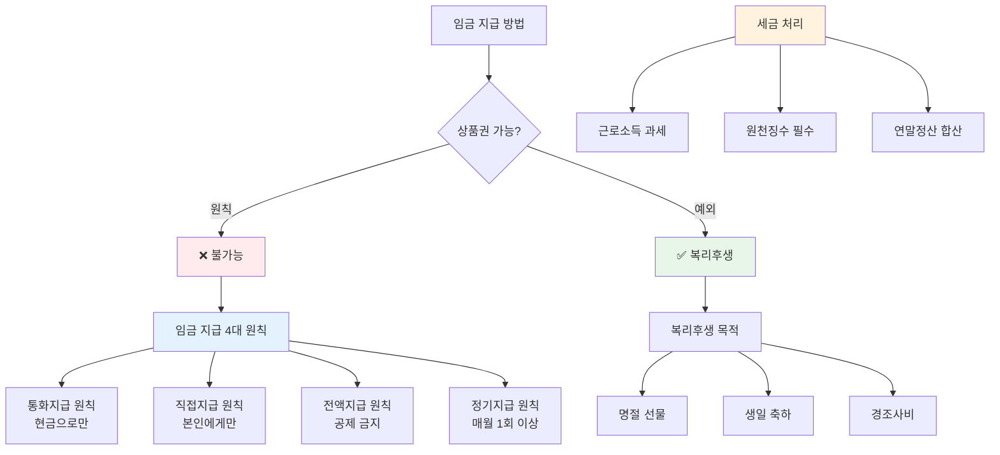

"회사에서 월급을 상품권으로 준대요. 이게 괜찮은 건가요?"

원칙은 안 돼요. [근로기준법 제43조](https://www.law.go.kr/법령/근로기준법)에서 임금은 반드시 현금으로 지급하라고 정하고 있어요. 예외적으로 복리후생 목적이면 가능하지만 세금은 내야 해요.

## 임금 상품권 지급이 안 되는 이유는 뭔가요?

**근로기준법에서 임금은 현금으로 전액 지급하라고 정했어요.**

[근로기준법 제43조](https://www.law.go.kr/법령/근로기준법) 제1항에 따르면 임금은 통화로 직접 근로자에게 그 전액을 지급해야 해요. 여기서 통화는 대한민국 원화를 말하고, 상품권이나 현물은 통화가 아니에요.

왜 이렇게 정했을까요? 과거에 공장에서 월급 대신 쌀이나 옷을 줬던 시절이 있었어요. 근로자가 원하지 않는 물건을 받거나 시세보다 비싸게 계산해서 손해를 봤죠. 이런 부당한 일을 막으려고 현금 지급 원칙을 만들었어요.

단, 법령이나 단체협약에 특별한 규정이 있으면 예외적으로 현금 외의 방법도 가능해요. 하지만 회사 맘대로는 안 돼요.

## 임금 법적 기준은 어떻게 되나요?

**임금 지급 4대 원칙이 있어요.**

[찾기쉬운 생활법령정보](https://easylaw.go.kr/CSP/CnpClsMain.laf?popMenu=ov&csmSeq=1694&ccfNo=2&cciNo=2&cnpClsNo=1)에 따르면 임금 지급 4대 원칙은 다음과 같아요.

**통화지급 원칙**
- 현금으로 지급해야 해요
- 상품권, 수표, 현물 지급 금지
- 법령이나 단체협약에 규정 있으면 예외

**직접지급 원칙**
- 근로자 본인에게 직접 줘야 해요
- 가족이나 대리인에게 주면 안 돼요
- 미성년자도 본인에게 직접 지급

**전액지급 원칙**
- 월급에서 함부로 공제하면 안 돼요
- 세금, 4대 보험료만 공제 가능
- 회식비나 경조사비 공제는 위법

**정기지급 원칙**
- 매월 1회 이상 일정한 날짜에 줘야 해요
- "다음 달에 몰아서 줄게" 안 돼요
- 연봉제도 매월 지급 원칙 적용

이 중 통화지급 원칙이 상품권 지급을 금지하는 근거예요. 회사가 "상품권도 돈이랑 비슷하잖아"라고 해도 법적으로 인정 안 돼요.

## 임금 유효성은 어떻게 판단하나요?

**임금인지 복리후생인지에 따라 달라져요.**

상품권 지급이 유효한지 판단하려면 먼저 그게 임금인지 복리후생인지 구분해야 해요. 이 둘은 법적으로 완전히 달라요.

**임금으로 보는 경우**
- 근로의 대가로 정기적으로 주는 돈
- 월급, 상여금, 각종 수당
- 반드시 현금 지급해야 함
- 상품권 지급 시 근로기준법 위반

**복리후생으로 보는 경우**
- 근로 대가와 관계없이 주는 혜택
- 명절 선물, 생일 축하, 경조사비
- 상품권 지급 가능
- 단, 근로소득세 과세 대상

[서울고등법원 2015. 10. 30. 선고 2014나28208 판결](https://casenote.kr/서울고등법원/2014나28208)에서는 명절에 주는 상품권이 통상임금인지 다퉜어요. 법원은 "명절 당일 재직자에게만 주는 거라서 고정성이 없다"며 통상임금이 아니라고 판단했어요.

결국 핵심은 이거예요. 매달 주는 월급을 상품권으로 주면 위법이고, 명절이나 생일에 복지 차원에서 주는 건 괜찮아요.

## 임금 관련해서 상품권 받으면 세금은 어떻게 되나요?

**복리후생 명목이어도 근로소득세 내야 해요.**

상품권을 받으면 국세청에서 근로소득으로 봐요. 회사는 근로자에게 상품권 줄 때 원천징수해야 하고, 연말정산 때 합산돼요.

예를 들어볼게요. 명절에 10만 원짜리 상품권을 받았다면, 이 10만 원은 근로소득에 포함돼요. 회사가 "이건 선물이니까 세금 안 떼도 돼"라고 하면 나중에 국세청에서 문제 삼을 수 있어요.

**실무 처리 방법**
- 상품권 지급 시 급여명세서에 기재
- 원천징수세 공제 후 지급
- 연말정산 시 근로소득에 합산

회사가 복리후생비로 처리하고 세금을 안 떼면 어떻게 될까요? 국세청에서 회사 대표의 상여로 보고 대표에게 세금을 부과할 수 있어요. 증빙 없이 상품권 구입비를 경비 처리하는 건 위험해요.

<a href="https://www.moel.go.kr/index.do" target="_blank" rel="noopener noreferrer" class="ext-btn ext-btn-dark">
  고용노동부 공식
  임금 체불 신고 안내
  바로가기 →
</a>

## 출처

- [근로기준법 제43조](https://www.law.go.kr/법령/근로기준법) - 법제처
- [임금 지급 방법](https://easylaw.go.kr/CSP/CnpClsMain.laf?popMenu=ov&csmSeq=1694&ccfNo=2&cciNo=2&cnpClsNo=1) - 찾기쉬운 생활법령정보
- [서울고등법원 2014나28208 판결](https://casenote.kr/서울고등법원/2014나28208) - CaseNote
