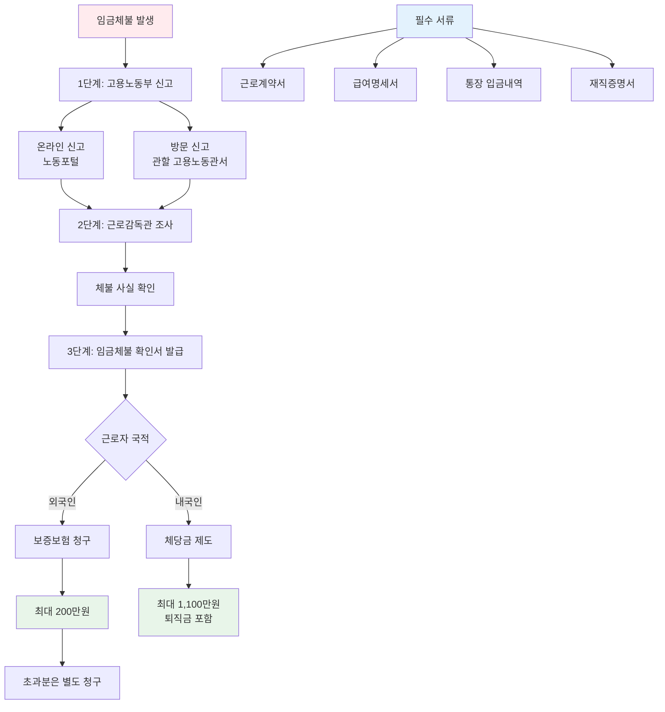

"회사가 3개월째 월급을 안 줘요. 보증보험으로 받을 수 있다는데 어떻게 하나요?"

가능해요. 임금체불 보증보험은 외국인 근로자를 위한 제도예요. [고용노동부에 신고](https://labor.moel.go.kr/minwonSysInfo/wagesolway.do)해서 확인서를 받으면 보험금을 청구할 수 있어요. 단계별로 알려드릴게요.

## 임금체불 보험금 청구는 어떻게 하나요?

**고용노동부 신고 → 확인서 발급 → 보험회사 청구 순서예요.**

[찾기쉬운 생활법령정보](https://easylaw.go.kr/CSP/CnpClsMain.laf?popMenu=ov&csmSeq=3&ccfNo=2&cciNo=3&cnpClsNo=2)에 따르면 임금체불 보증보험 보험금을 받으려면 3단계를 거쳐야 해요.

**1단계: 고용노동부 신고**
- 사업장 소재지 관할 고용노동관서 방문
- 또는 [노동포털](https://labor.moel.go.kr/minwonSysInfo/wagesolway.do)에서 온라인 진정 접수
- 임금체불 사실을 증명할 서류 제출

**2단계: 임금체불 확인서 발급**
- 근로감독관 조사 진행 (1~2주 소요)
- 체불 사실 확인되면 확인서 발급
- 처리 기간: 접수일로부터 25일 이내 (1회 연장 가능)

**3단계: 보험회사에 보험금 청구**
- 서울보증보험에 확인서 제출
- 보증금액 한도(200만원) 내에서 지급
- 초과 금액은 별도 법적 절차 필요

중요한 건 반드시 고용노동부 확인서가 있어야 한다는 거예요. 확인서 없이는 보험금 청구가 불가능해요.

## 임금체불 신청 절차는 어떻게 되나요?

**온라인 또는 방문 신고 후 조사받으면 돼요.**

[고용노동부 노동포털](https://labor.moel.go.kr/minwonSysInfo/wagesolway.do)에서 신청하는 게 가장 빠르고 편해요. 2026년 기준으로 비대면 조사가 강화돼서 증거 자료만 제대로 준비하면 출석 없이도 처리 가능해요.

**온라인 신고 방법**
- 노동포털 접속 후 회원가입
- '임금체불 진정' 메뉴 선택
- 체불 내용 작성 및 증거 첨부
- 제출 후 담당자 배정 대기

**방문 신고 방법**
- 사업장 관할 고용노동관서 방문
- 진정서 작성 및 제출
- 증거 서류 함께 제출

진정서가 접수되면 1~2주 안에 사업주와 근로자에게 출석요구서가 발송돼요. 근로감독관이 양측 의견을 듣고 증거를 검토한 뒤 체불 여부를 판단해요.

만약 사업주가 "안 줬다"는 사실을 인정하고 금액에도 이견이 없으면 빠르게 확인서가 나와요. 다투는 경우엔 시간이 더 걸릴 수 있어요.

## 임금체불 필요 서류는 뭐가 있나요?

**근로계약서, 급여명세서, 입금 내역이 핵심이에요.**

[정부24](https://www.gov.kr/mw/AA020InfoCappView.do?HighCtgCD=A09003&CappBizCD=14920000065)에서 체불 임금 확인서를 신청할 때 필요한 서류들이에요. 증거가 많을수록 유리해요.

**필수 서류**
- 근로계약서 사본
- 급여명세서 또는 급여대장
- 통장 입금 내역 (최근 6개월)
- 재직증명서 또는 4대보험 가입확인서

**추가 증빙 서류**
- 출퇴근 기록 (근로시간 증명)
- 업무 관련 문자나 카톡 내역
- 동료 증언서 (선택)
- 체불 월급 관련 회사 공지

근로계약서가 없으면 어떡하나요? 걱정 마세요. 4대보험 가입 내역이나 급여 입금 기록으로도 근로 사실을 증명할 수 있어요. 심지어 문자나 녹음 파일도 증거로 인정돼요.

급여명세서가 없다면? 통장 입금 내역을 캡처하거나 은행에서 거래내역서를 발급받으세요. 입금 패턴만 봐도 월급인지 알 수 있어요.

**서류 준비 팁**
- 모든 서류는 원본과 사본 각 1부씩
- 문자/카톡은 날짜가 보이게 캡처
- 통장 사본은 계좌번호 뒷자리 가려도 됨
- 여권 사본 (외국인 근로자만)

## 임금체불 관련해서 보험금은 얼마나 받나요?

**외국인 근로자는 최대 200만원까지 받을 수 있어요.**

임금체불 보증보험은 외국인 근로자 전용이에요. 사업주가 가입한 보험에서 체불된 월급을 대신 지급하는 제도죠.

**보험금 한도**
- 최대 200만원까지 보장
- 체불 금액이 200만원 초과 시 한도까지만 지급
- 초과 금액은 민사소송이나 체당금 신청 필요

예를 들어볼게요. 3개월간 월 100만원씩 300만원이 밀렸다면? 보험에서 200만원 받고, 나머지 100만원은 별도로 청구해야 해요. [임금체불 신고방법](/w/임금체불-신고방법)에서 자세한 절차를 확인하세요.

**내국인은 어떻게 하나요?**
- 내국인 근로자는 보증보험 대상 아님
- 대신 체당금 제도 이용 가능
- 체당금은 최대 1,100만원까지 보장 (퇴직금 포함)
- [체당금 신청](/w/체당금-신청)으로 별도 진행

**2026년 변경 사항**
- 재직 중에도 연 20% 지연이자 적용 (2025년 10월 23일부터)
- 퇴직자뿐 아니라 재직자도 지연이자 받을 수 있음
- 매월 정해진 지급일 안 지키면 즉시 이자 발생

회사가 "다음 달에 몰아서 줄게"라고 해도 지연이자는 발생해요. 월급날 못 받으면 바로 연 20% 이자가 붙어요.

<a href="https://labor.moel.go.kr/minwonSysInfo/wagesolway.do" target="_blank" rel="noopener noreferrer" class="ext-btn ext-btn-green">
  고용노동부 공식
  임금체불 온라인 신고
  신고하기 →
</a>

## 출처

- [외국인근로자 고용 사용자 준수사항](https://easylaw.go.kr/CSP/CnpClsMain.laf?popMenu=ov&csmSeq=3&ccfNo=2&cciNo=3&cnpClsNo=2) - 찾기쉬운 생활법령정보
- [체불 임금등·사업주 확인서 발급신청](https://www.gov.kr/mw/AA020InfoCappView.do?HighCtgCD=A09003&CappBizCD=14920000065) - 정부24
- [임금체불 해결방법](https://labor.moel.go.kr/minwonSysInfo/wagesolway.do) - 고용노동부 노동포털
