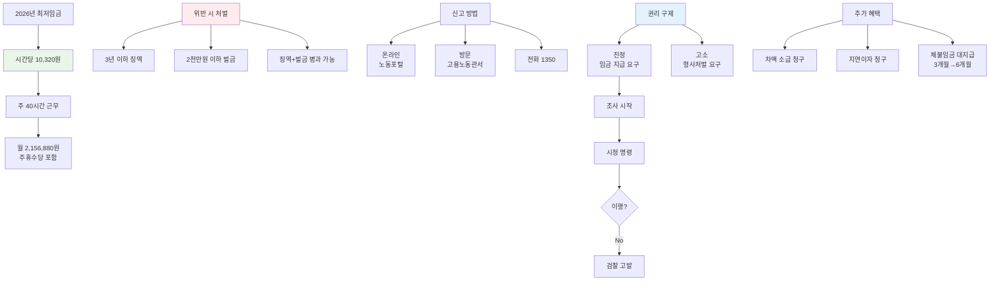

아르바이트하는데 시급이 최저임금보다 낮아요. 이거 불법 아닌가요? 맞아요, 최저임금법 위반이에요. 사장님이 처벌받을 수 있고, 못 받은 돈도 받을 수 있어요. 어떻게 신고하고 어떤 처벌을 받는지 알려드릴게요.

## 최저임금 위반은 어떤 처벌을 받나요?

**사용자는 3년 이하 징역 또는 2천만원 이하 벌금을 받아요.**

[최저임금법 제28조](https://www.law.go.kr/법령/최저임금법)에서 명확하게 정하고 있어요.
최저임금보다 적게 주거나 최저임금을 이유로 기존 임금을 낮추면 형사처벌 대상이에요.
징역과 벌금을 동시에 받을 수도 있고, 실제로 판례에서도 벌금형이 많이 선고되고 있어요.
최저임금 내용을 근로자에게 알리지 않으면 100만원 이하 과태료도 별도로 나와요.

## 최저임금 신고 방법은 어떻게 되나요?

**고용노동부 노동포털에서 온라인으로 임금체불 진정을 제기하면 돼요.**

[고용노동부 노동포털](https://labor.moel.go.kr)에 접속해서 근로계약서, 급여명세서, 통장 내역을 준비하세요.
출퇴근 기록이나 근무시간을 증명할 수 있는 자료도 함께 첨부하면 좋아요.
온라인이 어렵다면 사업장 관할 고용노동관서를 직접 방문해서 상담받을 수도 있어요.
전화 상담은 고용노동부 고객상담센터 국번없이 1350번으로 문의하면 돼요.

| 신고 방법 | 절차 | 준비 서류 |
|----------|------|----------|
| 온라인 | 노동포털 접속 | 근로계약서, 급여명세서, 통장 내역 |
| 방문 | 관할 고용노동관서 | 신분증, 증거 자료 일체 |
| 전화 상담 | 1350번 | 기본 정보 확인 |

[찾기쉬운 생활법령정보](https://easylaw.go.kr)에서도 자세한 신고 절차를 확인할 수 있어요.
신고 시 익명으로도 가능하지만, 실명 신고가 처리 속도가 더 빨라요.

## 최저임금 처벌 규정의 법적 근거는 뭔가요?

**최저임금법과 근로기준법에서 처벌 근거를 명시하고 있어요.**

[최저임금법 제6조](https://www.law.go.kr/법령/최저임금법)는 사용자가 최저임금액 이상을 지급해야 한다고 정하고 있어요.
이를 위반하면 제28조 제1항에 따라 3년 이하 징역 또는 2천만원 이하 벌금에 처해져요.
최저임금을 이유로 기존 임금을 낮춰도 똑같이 처벌받아요.
2026년 최저임금은 시간당 10,320원이니까 주 40시간 근무 시 주휴수당 포함해서 월 215만 6,880원 이상 받아야 해요.

실제 판례를 보면 2023년 서울지방법원은 최저임금 미만 지급한 사업주에게 벌금 300만원을 선고했어요.
[대법원 판례](https://glaw.scourt.go.kr)에서도 최저임금법 위반에 대해 엄격하게 처벌하고 있어요.
단순 실수라고 주장해도 통하지 않고, 고의가 인정되면 형사처벌 대상이에요.

<a href="https://labor.moel.go.kr/minwonSysInfo/wagesolway.do" target="_blank" rel="noopener noreferrer" class="ext-btn ext-btn-dark">
  고용노동부 공식
  체불임금 신고 안내
  바로가기 →
</a>

## 최저임금 관련 권리 구제는 어떻게 하나요?

**진정으로 밀린 임금을 받거나 고소로 사용자를 처벌할 수 있어요.**

진정은 "임금을 지급해 달라"고 요구하는 거고, 고소는 "처벌해 달라"고 요구하는 거예요.
진정을 제기하면 고용노동관서에서 조사를 시작하고, 사용자에게 시정 명령을 내려요.
시정 명령을 안 따르면 검찰에 고발되고, 형사처벌로 이어져요.
고소는 바로 형사처벌을 요구하는 거라서 더 강력하지만, 증거가 명확해야 해요.

최저임금 미만으로 일했다면 차액을 소급해서 받을 수 있어요.
예를 들어 시급 9,000원 받았는데 최저임금이 10,320원이면 차액 1,320원에 일한 시간을 곱한 금액을 청구할 수 있어요.
지연이자도 함께 청구 가능하니까 포기하지 말고 꼭 신고하세요.
[임금체불 신고](/w/임금체불-신고)에서 자세한 절차를 확인하세요.

2026년부터는 체불임금 대지급 범위가 3개월에서 6개월로 확대됐어요.
회사가 망해서 월급 못 받아도 [고용노동부](https://www.moel.go.kr)에서 대신 지급해주니까 걱정하지 마세요.
신고를 이유로 해고나 불이익을 주면 사용자가 추가로 처벌받으니 안심하고 신고하세요.

<a href="https://labor.moel.go.kr" target="_blank" rel="noopener noreferrer" class="ext-btn ext-btn-green">
  노동포털 공식
  임금체불 온라인 신고
  신청하기 →
</a>

## 출처

- [최저임금법](https://www.law.go.kr/법령/최저임금법) - 법제처
- [고용노동부 노동포털](https://labor.moel.go.kr) - 임금체불 신고
- [찾기쉬운 생활법령정보](https://easylaw.go.kr) - 최저임금 안내
- [대법원 판례](https://glaw.scourt.go.kr) - 최저임금법 위반 판례
