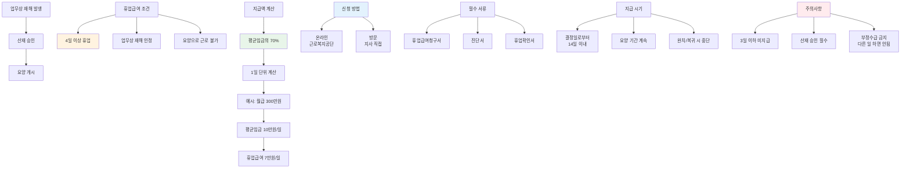

회사에서 다쳐서 병원 다니는데 월급은 어떻게 되는 거죠? 걱정하지 마세요. 휴업급여로 평균임금의 70%를 받을 수 있어요. 신청 방법부터 지급 규모까지 자세히 알려드릴게요.

## 휴업 임금이란 뭔가요?

**업무상 재해로 일 못하는 기간 동안 받는 보험급여예요.**

정식 명칭은 휴업급여라고 해요. 회사에서 일하다가 다치거나 병에 걸려서 병원 치료받는 동안, 일을 못해서 월급이 안 나오잖아요. 그때 받는 게 바로 휴업급여예요. [산업재해보상보험법](https://www.law.go.kr/법령/산업재해보상보험법)에서 정한 근로자 보호 제도예요. 단, 3일 이내로 쉬면 지급 안 되고, 최소 4일 이상 쉬어야 해요. 평균임금의 70%를 매일 계산해서 지급하고, 요양 기간 내내 받을 수 있어요.

## 휴업 신청 방법은 어떻게 되나요?

**근로복지공단에 휴업급여청구서를 제출하면 돼요.**

먼저 산재 승인을 받아야 해요. 산재 승인 없이는 휴업급여를 못 받거든요. 산재 승인받으면 휴업급여청구서를 작성해서 근로복지공단 지사에 내면 돼요. 온라인으로는 근로복지공단 홈페이지에서 신청 가능하고, 방문 신청도 돼요. 진단서나 휴업확인서 같은 서류를 첨부해야 하니까 병원에서 미리 받아두세요. [산재 요양급여 신청](/w/산재-요양급여) 방법도 함께 확인하면 도움돼요.

| 신청 방법 | 장점 | 준비서류 |
|-----------|------|----------|
| 온라인 신청 | 빠르고 편리 | 진단서, 휴업확인서 스캔본 |
| 방문 신청 | 상담 가능 | 진단서, 휴업확인서 원본 |

<a href="https://www.comwel.or.kr/comwel/board/CLAIMREGISTER.jsp" target="_blank" rel="noopener noreferrer" class="ext-btn ext-btn-green">
  근로복지공단 공식
  휴업급여 신청하기
  신청하기 →
</a>

## 휴업 지원 규모는 얼마나 되나요?

**평균임금의 70%를 1일 단위로 계산해서 받아요.**

예를 들어 월급이 300만원이면, 평균임금은 하루 10만원 정도 되겠죠? 그럼 휴업급여는 하루 7만원(70%)을 받는 거예요. 한 달 쉬면 약 210만원 받는 셈이에요. 지급 결정일로부터 14일 이내에 계좌로 입금돼요. 요양하는 동안 계속 받을 수 있고, 완치되거나 회사 복귀하면 중단돼요. [산재 보험급여 종류](/w/산재-보험급여)를 보면 다른 급여도 확인할 수 있어요.

## 휴업 관련 주의사항은 뭔가요?

**3일 이하 휴업은 지급 대상이 아니에요.**

짧게 1~3일 쉬는 건 휴업급여 못 받아요. 최소 4일 이상 쉬어야 신청할 수 있어요. 또 산재 승인이 안 되면 아예 신청 자체가 불가능해요. 그래서 사고 나면 바로 산재 신고하는 게 중요해요. 휴업 중에 다른 일 하면 부정수급이 될 수 있으니 절대 안 돼요. 적발되면 급여 환수는 물론 형사처벌까지 받을 수 있어요. 휴업급여 받는 동안에는 치료에만 집중하세요.

## 출처

- [산업재해보상보험법](https://www.law.go.kr/법령/산업재해보상보험법) - 법제처
- [휴업급여 안내](https://easylaw.go.kr/CSP/CnpClsMain.laf?popMenu=ov&csmSeq=575&ccfNo=3&cciNo=1&cnpClsNo=1) - 찾기쉬운 생활법령정보
- [근로복지공단](https://www.comwel.or.kr) - 휴업급여 신청
